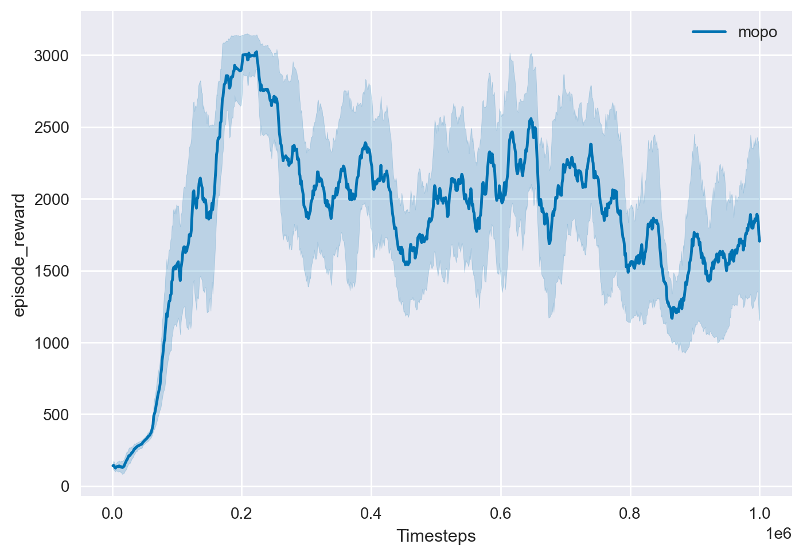
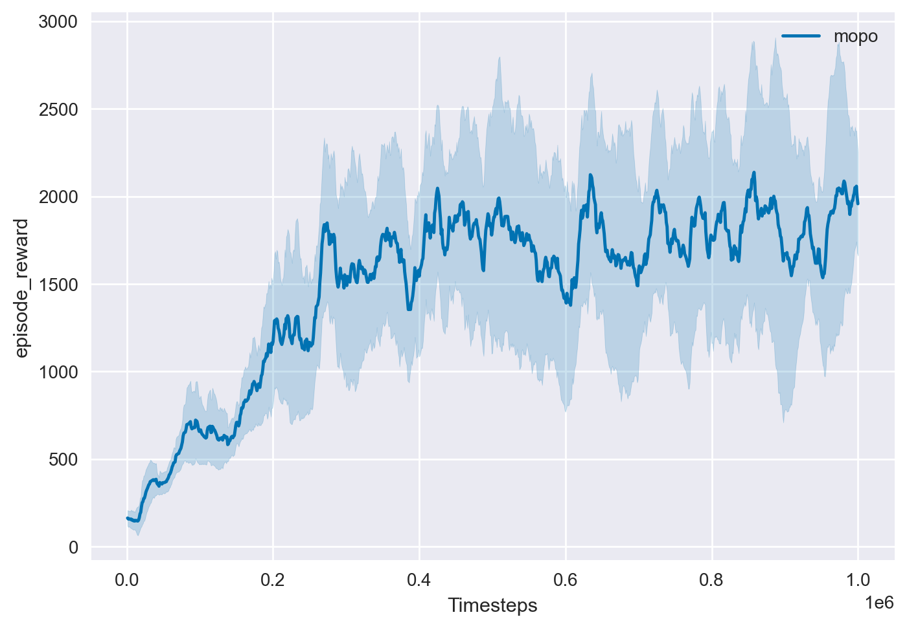
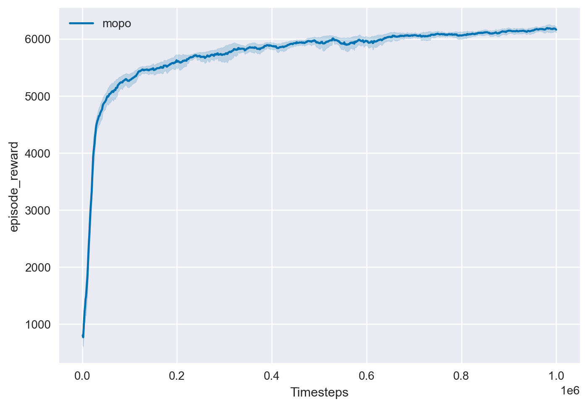

# Overview

This is a re-implementation of the offline model-based RL algorithm MOPO all by pytorch **(including dynamics and mopo algo)** as described in the following paper: [MOPO: Model-based Offline Policy Optimization](https://arxiv.org/pdf/2005.13239.pdf)

The performance of model-based RL algorithm greatly depends on the implementation of the ensemble dynamics model and we find that the performance of pytorch ensemble models implemented by third parties will be reduced compared with the official implementation. To this end, we reuse the official tensorflow version ensemble model. Don't worry, the implementation of the ensemble model is separate from our core code, which will not affect the simplicity of pytorch.

# Dependencies

- MuJoCo 2.0
- Gym 0.22.0
- D4RL
- PyTorch 1.8+

# Usage

# Noisy D4RL generation
Run noisy_d4rl.ipynb
Data saved in ```/abiomed/intermediate_data_d4rl/```

# Run world model for D4RL
```
python models/d4rl_world_model.py --epochs 100
```
for Noisy-D4RL ( i.e for noise level 0.5)
Current noise levels = (0.05, 0.1, 0.3, 0.5, 0.6, 0.8)
```
python models/d4rl_world_model.py --epochs 100 --data_path "/abiomed/intermediate_data_d4rl/hopper-expert-v0_noisy_0.05_unnorm.pkl" --n 0.05
```
# Run world model for MBPO
This model has 2 final heads for next state and reward prediction.
for normal D4RL
```
python models/d4rl_transition_world_model.py 
```
for Noisy-D4RL
```
python models/d4rl_transition_world_model.py --epochs 100 --data_path "/abiomed/intermediate_data_d4rl/hopper-expert-v0_noisy_0.05_unnorm.pkl" --n 0.05

```

# Train transition model
for normal D4RL
```
python models/train_transition_model.py 

```
for Noisy-D4RL

```
python models/train_transition_model.py --noise 0.05 --data_path "/abiomed/intermediate_data_d4rl/hopper-expert-v0_noisy_0.05_unnorm.pkl" 

```
Compare ensemble model and world model: see ```compare_models.ipynb```

# Train MBPO with world model
This script can run both mbpo and mopo. Train function is in ```train_world_transition.py```.
```
python mopo_world.py --algo-name mbpo --transition_model_path "saved_models/hopper-expert-v0_noisy/transition_world_model_0.01_0.0.pth" --task hopper-expert-v0 --reward-penalty-coef 0 --epoch 100
```
Saved model naming convention: 
- world_model or transition_world_model: without/with reward head
- 0.01: train loss at the last epoch rounded up to 2nd decimal point.
- 0.0, 0.1, etc: noise level

# Train MOPO with world model and std penalty

```
python mopo_world.py --algo-name mopo --transition_model_path "saved_models/hopper-expert-v0_noisy/transition_world_model_v2_0.00_0.0.pth" --task hopper-expert-v0 --reward-penalty-coef 0.01 --epoch 100 --devid 1
```


# UAMBPO
```
# for Abiomed

python uambpo.py --task 'Abiomed-v0' --device_id 1
```

## Train

```
# for hopper-medium-replay-v0 task
python train.py --task "hopper-medium-replay-v0" --rollout-length 5 --reward-penalty-coef 1.0
# for walker2d-medium-replay-v0 task
python train.py --task "walker2d-medium-replay-v0" --rollout-length 1 --reward-penalty-coef 1.0
# for halfcheetah-medium-replay-v0 task
python train.py --task "halfcheetah-medium-replay-v0" --rollout-length 5 --reward-penalty-coef 1.0
```

For different mujoco tasks, the only differences of hyperparameters are "rollout-length" and "reward-penalty-coef". Please see the original paper for other tasks' hyperparameters.

## Plot

```
python plotter.py --root-dir "log" --task "hopper-medium-replay-v0"
```

# Reproduced results
All experiments were run for 2 random seeds each and learning curves are smoothed by averaging over a window of 10 epochs.

### hopper-medium-replay-v0



### walker2d-medium-replay-v0



### halfcheetah-medium-replay-v0



# Reference

- Official tensorflow implementation: [https://github.com/tianheyu927/mopo](https://github.com/tianheyu927/mopo)